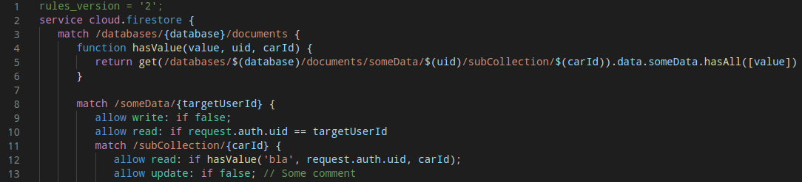
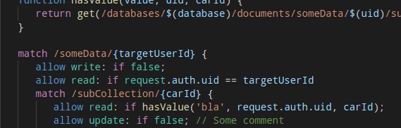
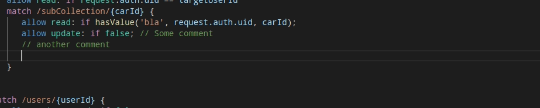
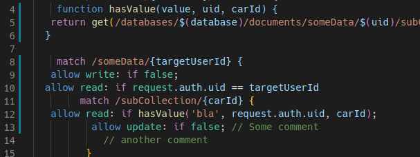

# Firestore

Firestore security rule support for Visual Studio Code.

Works for `.rule` and `.rules` files.

## Features

### Syntax Highlighting

### Mouseover Information

### Autocomplete Suggestions

### Autoformatting

Only works for valid rules and currently only formats the indentation.

**Experimental:**
Version 1.3.0 intoduced a new formatter option which can be enabled in the configuration, `firestorerules.usePrettierFormatter`.
When the option is enabled, the project uses [prettier](https://prettier.io/) and the [prettier-plugin-firestore-rules](https://github.com/ChFlick/prettier-plugin-firestore-rules) to format the firestore rules.

## Known Issues

* The documentation of the get(/path/) function is currently not correct

This extension is still very fresh and under development, so if you have any issues, please [report them on GitHub](https://github.com/ChFlick/firecode/issues).

## Development

I'm working on improving the prettier-plugin-firestore-rules formatter as well as the corresponding [firestore rules parser (WIP)](https://github.com/ChFlick/prettier-plugin-firestore-rules).

When the parser is in a proper shape, it will be included to provide validation of the firestore rules.
